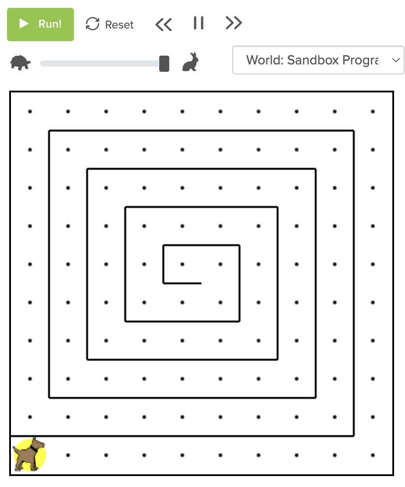
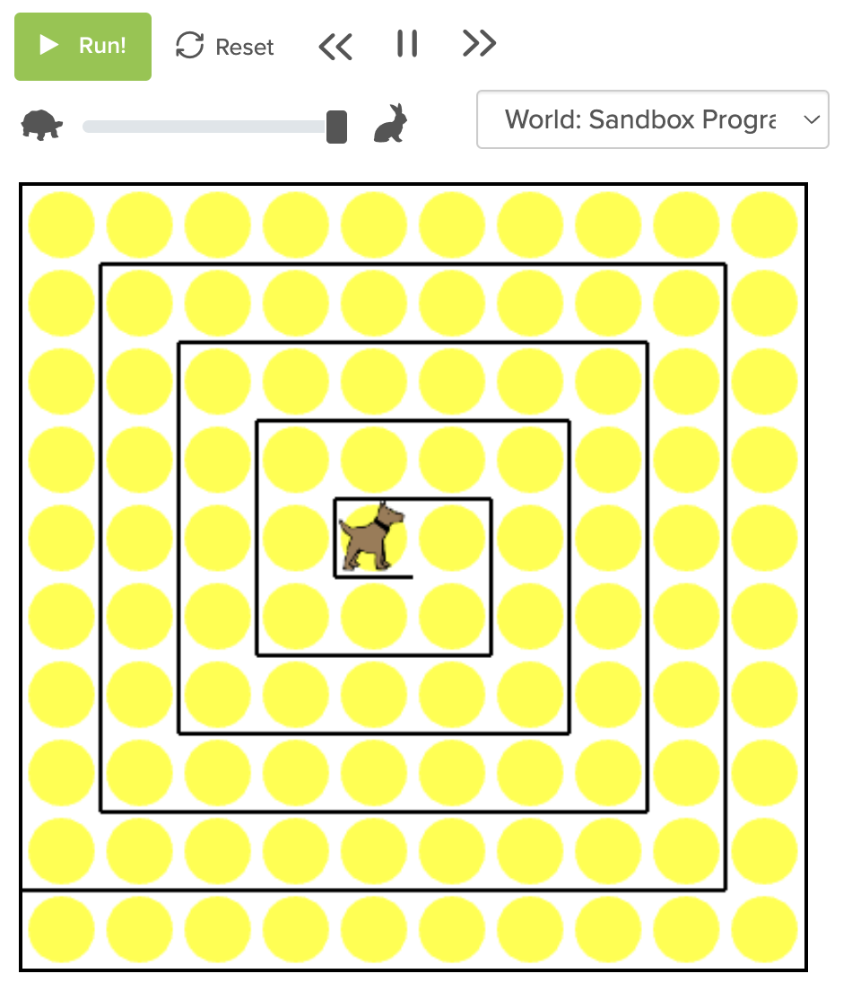

# csp
Some Karel code from CodeHS and Python

## Efficient Code

[Try yourself on CodeHS here](https://codehs.com/sandbox/mkreier2022/10-minute-task-2022-09-19) or this [Task 218](https://codehs.com/sandbox/mkreier2022/mastery-check-module-2-challenge-218).

The starting point to the maze looks like the left, the final is the right. What is the minimum amount of lines to solve the maze, put a ball on each spot and face East? The [218 procedural steps](https://github.com/kreier/csp2022/blob/main/UltraKarel/spiral.py) could possibly be reduced with some algorithms.

 

### Shortest solution - just 5 lines, Hajoon 2022/09/19

``` py
for i in range(20):
    while front_is_clear():
        move()
        put_ball()
    turn_left()
```

### No condition (if or while) allowed - 6 lines

``` py
x = [9,9,9,8,8,7,7,6,6,5,5,4,4,3,3,2,2,1,1,0]
for k in range(len(x)):
    for j in range(x[k]):
        move()
        put_ball()
    turn_left()
```

### No list or arrays allowed - 10 lines, Thai 2022/09/20

Down to 10 lines?

``` py
row, repeat = 9, 3
for i in range(9):
    for j in range(repeat):
        for k in range(row):
            move()
            put_ball()
        turn_left()
    repeat = 2
    row -= 1
turn_left()
```

Prior it were 11 lines by Alex:

``` py
for i in range(9):
    move()
    put_ball()
turn_left()
for i in range(9):
    for j in range(2):
        for k in range(9-i):
            move()
            put_ball()
        turn_left()
turn_left()
```

#### Update 2022/09/21 - 9 lines is enough

``` py
repeat = 3
for i in range(9,0,-1):
    for j in range(repeat):
        for k in range(i):
            move()
            put_ball()
        turn_left()
    repeat = 2
turn_left()
```
