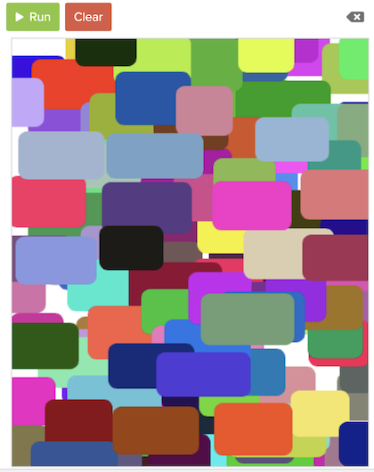

# Graphics in CodeHS and Python

Here are some examples:

``` py
import random

def rc(x, y):
    for i in range(5):
        round_corners(random.randint(0,get_width()), random.randint(0,get_height()))
    round_corners(x, y)

def round_corners(x, y):
    COLOR = f"#{random.randint(0,16777215):06X}"
    dx, dy = random.randint(0,50), random.randint(0,10)
    circ = Circle(10)
    circ.set_position(x-20, y-15)
    circ.set_color(COLOR)
    add(circ)
    circ = Circle(10)
    circ.set_position(x+20+dx, y-15)
    circ.set_color(COLOR)
    add(circ)
    circ = Circle(10)
    circ.set_position(x-20, y+15+dy)
    circ.set_color(COLOR)
    add(circ)
    circ = Circle(10)
    circ.set_position(x+20+dx, y+15+dy)
    circ.set_color(COLOR)
    add(circ)
    rect = Rectangle(60+dx, 30+dy)
    rect.set_position(x-30, y-15)
    rect.set_color(COLOR)
    add(rect)
    rect = Rectangle(40+dx, 50+dy)
    rect.set_position(x-20, y-25)
    rect.set_color(COLOR)
    add(rect)

add_mouse_click_handler(rc)

for i in range(50):
    round_corners(random.randint(0,get_width()), random.randint(0,get_height()))
```

And it looks like this:


